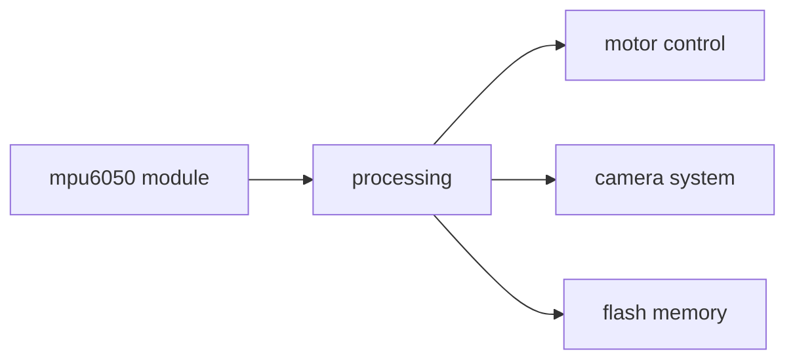
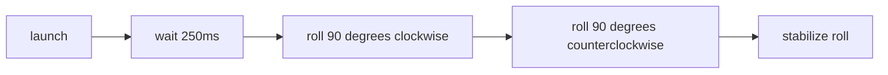

# Bethel University Roll Control Code 25/26

For part B in the ["Secret Message Challenge from the Midwest Rocketry Competition 2025/2026](https://dept.aem.umn.edu/mnsgc/Space_Grant_Midwest_Rocketry_Competition_2025_2026/Midwest_Rocketry_Competition_Handbook_2025-2026_v7.pdf#page=4). Including logging status of the roll control mechanism as per part C.

Controls the speed of a motor driving a reaction wheel to control the roll of a rocket in flight. Attempts to rotate 90 degrees clockwise, counter-clockwise, and stabilize the rocket before apogee.

## Architecture

This program was designed to control a motor while logging and transmitting relevant data with a single-core methodology.

### Dataflow

This roll control system controls driving a reaction wheel, sending its attempted rotation direction to the camera system, and logging its roll data.



### Controlflow

This system turns off after a hard-coded amount of time determined by simulated apogee time.



## Design Decisions

### Wireless

This roll control system communicates wirelessly with the camera system by connecting to an Access Point hosted by the camera system.

### 90 Degrees Clockwise

The motor is accelerated as quickly as possible to its max speed to turn the rocket clockwise 90 degrees.

### 90 Degrees Counter-Clockwise

The motor is accelerated as quickly as possible to the opposite side as the clockwise direction to turn the rocket counter-clockwise 90 degrees.

### Stable

The motor cumulatively updates its speed every 250ms to gradually counteract any roll. The motor's final speed is determined mostly from the current roll speed, but also partially from the rotational distance from 0 degrees.

## Limitations

### Run Time

Run time needs to manually be changed in code to a new hard-coded time if the system needs to run for a different amount of time.

### Storage

The system logs its data to its internal flash memory, which means it only has 2-3MB of storage before it runs out of space. It logs data at roughly 0.1MB/minute.

### Wireless

If the system does not find a wireless connection on boot, or loses connection, it will not try to find a connection again.

### Indicator Lights

The roll control system is dependent on several external components to achieve the indicator light portion of the challenge.

- The camera system's Access Point must be up
- The camera system's wiring to the indicator lights needs to be valid
- The indicator lights need to be in view of the camera

## Retrospective

### Main File Length

While the functions in the main.py file help to modularize the system's code, the length of the file itself made it occasionally difficult to find one part to modify.

Breaking each function or related functions into their own files would allow for faster debugging and more clear separation of concerns.

## Tests

Each test folder contains a context.txt file which provides further context for each test.

### functionality_tests

Contains integration tests and a test to ensure the system is able to be programmed.

## gyro_tests

Contains tests to ensure the gyroscope is working as expected.

## motor_tests

Contains tests to ensure the motor is able to be controlled as expected.

## Lite User Guide

### Annotated Data Format

```
    time from launch         -> time from launch detection in (milliseconds)
    intended roll direction  -> direction the system is trying to roll
    cumulative roll          -> total roll detected from the gyroscope since launch
    delta roll               -> how fast the system is rolling
    motor speed              -> what the system is sending to the motor for speed
```

### Use

Also refer to the file ```setup.txt``` in the root directory.

1. Install ```Micropython``` on a microcontroller
2. Copy ```main.py```, ```MPU6050.py```, and ```motor_controller.py` into the microcontroller
3. Ensure an appropriate gyroscope/accelerometer and motor_controller are wired to the microcontroller
4. Run the microcontroller

#### Easily Modifiable Variables

In ```main.py``` the variables ```LAUNCH_THRESHOLD``` and ```MOTOR_STILL``` are designed to be quickly modified to change how the system works.

- ```LAUNCH_THRESHOLD``` the acceleration threshold in g's the system needs to be moving to detect launch.
- ```MOTOR_STILL``` the default value given to the motor to have 0 roll.
